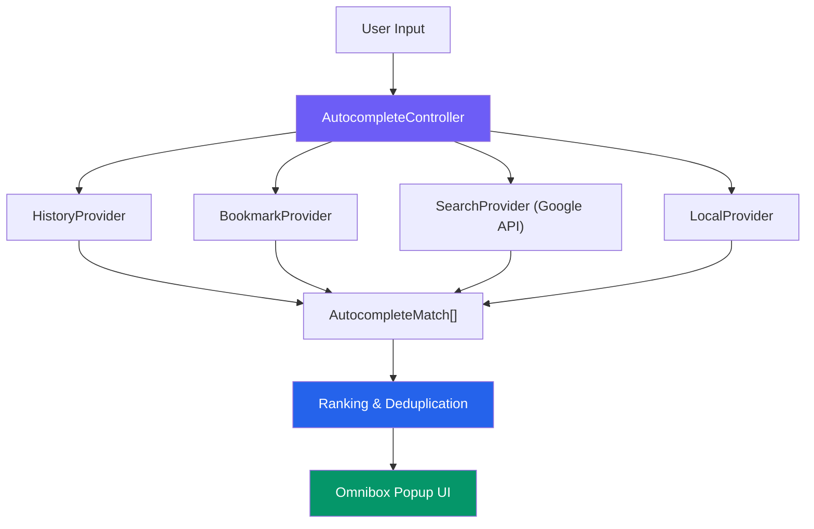

# Lộ trình Hoàn thiện Thanh Tìm kiếm TutorHub → Google-like Omnibox

## Tổng quan Nghiên cứu Google Search

Sau khi nghiên cứu kỹ UX của Google Search, Chrome Omnibox, Apple Spotlight và Slack Search, dưới đây là các tính năng cốt lõi mà TutorHub cần có:

### 6 Tính năng Cốt lõi của Google Search

| #   | Tính năng                    | Mô tả                                                                     | TutorHub hiện tại                   |
| --- | ---------------------------- | ------------------------------------------------------------------------- | ----------------------------------- |
| 1   | **Zero-Input State**         | Khi click vào ô tìm kiếm nhưng chưa gõ gì → hiện lịch sử + gợi ý trending | ✅ Có cơ bản (HistorySearchProvider) |
| 2   | **Autocomplete as-you-type** | Gõ đến đâu gợi ý đến đó, debounce để không giật                           | ⚠️ Có debounce nhưng popup vẫn nháy  |
| 3   | **Inline Completion**        | Text mờ (ghost text) hiện bên phải con trỏ để hoàn thành câu              | ❌ Chưa có                           |
| 4   | **Grouped Results**          | Kết quả phân nhóm: Top match, Commands, History, Messages, Classes, Web   | ⚠️ Có nhóm nhưng chưa đủ providers   |
| 5   | **Rich Result Icons**        | Mỗi loại kết quả có icon riêng (🕐 history, 🔍 search, 📋 command, 🌐 web)    | ⚠️ Có text badge, chưa có icon thật  |
| 6   | **Web Fallback**             | Dòng cuối cùng: "Tìm trên Google: [query]" → mở trình duyệt               | ✅ Đã có WebSearchProvider           |

### Kiến trúc Chrome Omnibox (Nguồn tham khảo)

---

## Gap Analysis: TutorHub vs Google

### ✅ Đã hoàn thành
- `SearchQuery.java` – Chuẩn hóa tiếng Việt (NFD, bỏ dấu, replace đ→d)
- `SearchResult.java` – Model builder pattern chuẩn
- `SearchController.java` – Gom kết quả từ nhiều providers
- `CommandSearchProvider` – Lệnh nhanh: Mở Bảng tin, Mở Lịch...
- `WebSearchProvider` – Mở Google Search trên trình duyệt
- `HistorySearchProvider` + `SearchHistoryStore` – Lưu/hiển thị lịch sử
- `SearchDropdownWindow` (JWindow) – Dropdown không nháy

### ❌ Chưa làm (Cần triển khai)

| Gap                                | Google có                               | TutorHub thiếu                                  | Độ ưu tiên   |
| ---------------------------------- | --------------------------------------- | ----------------------------------------------- | ------------ |
| **Real-time data providers**       | Tìm trong bookmark, history, tabs       | Chưa có ChatSearchProvider, ClassSearchProvider | 🔴 Cao        |
| **Inline Completion (Ghost text)** | Gợi ý mờ ngay trong ô nhập              | Không có                                        | 🟡 Trung bình |
| **Highlight matched text**         | Chữ khớp được **bôi đậm**               | Không highlight                                 | 🔴 Cao        |
| **Top Match**                      | Kết quả tốt nhất đứng riêng ở trên cùng | Không phân biệt                                 | 🟡 Trung bình |
| **Async providers**                | Search engine gọi async, local trả ngay | Tất cả đang synchronous                         | 🔴 Cao        |
| **Loading state**                  | Hiện spinner khi đang tìm               | Không có                                        | 🟡 Trung bình |
| **Keyboard shortcut Ctrl+K**       | Focus vào ô tìm kiếm                    | Đã code nhưng chưa wire                         | 🟢 Thấp       |
| **Real icons (SVG)**               | Icon phù hợp cho mỗi loại               | Text badge (HOME, MSG...)                       | 🟡 Trung bình |
| **Search within messages**         | Tìm nội dung tin nhắn                   | ChatTab riêng lẻ, chưa tích hợp                 | 🔴 Cao        |
| **Cancel request cũ**              | Hủy search cũ khi gõ thêm               | Không cancel                                    | 🟡 Trung bình |

---

## Lộ trình 7 Phase

### Phase A — Sửa Nháy & Ổn định Dropdown ⏱️ 1-2 ngày

> [!CAUTION]
> **Đây là vấn đề đang gặp và cần fix trước tiên.**

**Mục tiêu:** Dropdown mở/đóng mượt mà, không nháy, không mất focus.

| Task | Chi tiết                                                                                  |
| ---- | ----------------------------------------------------------------------------------------- |
| A1   | Kiểm tra `SearchDropdownWindow` đang hoạt động chưa (JWindow thay JPopupMenu)             |
| A2   | Verify `GlobalSearchBar` dùng `SearchDropdownWindow` chứ không còn `SearchDropdownPanel`  |
| A3   | Fix bất kỳ regression nào giữa `HeaderPanel` → `GlobalSearchBar` → `SearchDropdownWindow` |
| A4   | Tắt/xóa `SearchSuggestionsPopup.java` legacy để tránh popup cũ chạy song song             |
| A5   | Test thủ công: click, gõ, Enter, Esc, click outside                                       |

**Files:**
- `GlobalSearchBar.java` (verify)
- `SearchDropdownWindow.java` (verify)
- `HeaderPanel.java` (verify wiring)
- `SearchSuggestionsPopup.java` (disable/remove)

---

### Phase B — Highlight Matched Text & Nhóm "Top Match" ⏱️ 1 ngày

**Mục tiêu:** Giống Google, phần text khớp với query được **bôi đậm** trong kết quả.

| Task | Chi tiết                                                                                                             |
| ---- | -------------------------------------------------------------------------------------------------------------------- |
| B1   | Tạo utility `SearchTextHighlighter.java` – nhận (text, query) → trả HTML hoặc AttributedString với phần match in đậm |
| B2   | Cập nhật `ResultRow` trong `SearchDropdownWindow` dùng `JLabel` với HTML: `<html>Mở <b>Lịch</b></html>`              |
| B3   | Thêm nhóm "Top Match" – kết quả có score cao nhất đứng riêng ở trên cùng, tách khỏi nhóm bình thường                 |
| B4   | Cập nhật `labelFor()` thêm type `TOP_MATCH`                                                                          |

**Files mới:** `SearchTextHighlighter.java`
**Files sửa:** `SearchDropdownWindow.java`, `SearchResultType.java`

---

### Phase C — Real Data Providers (Chat, Class, Blackboard) ⏱️ 2-3 ngày

> [!IMPORTANT]
> Đây là phase quan trọng nhất – biến thanh tìm kiếm từ "chỉ có lệnh nhanh" thành "tìm kiếm dữ liệu thật".

| Task | Chi tiết                                                                                                                   |
| ---- | -------------------------------------------------------------------------------------------------------------------------- |
| C1   | **`ChatSearchProvider`** – Tìm kiếm người dùng (gọi `NetworkManager.sendPacket("SEARCH_USER", ...)`) và conversation local |
| C2   | **`ClassSearchProvider`** – Tìm lớp học từ `ClassManagerTab`/`AcceptedClassTab` dữ liệu đã cache                           |
| C3   | **`BlackboardSearchProvider`** – Tìm bảng vẽ từ `BlackboardManagerTab`                                                     |
| C4   | **`DriveSearchProvider`** – Tìm tài liệu từ `DriveTab` (async)                                                             |
| C5   | Đăng ký tất cả providers mới vào `HeaderPanel.configureGlobalSearchCommands()`                                             |
| C6   | Giới hạn mỗi nhóm tối đa 3 kết quả trong dropdown                                                                          |

**Files mới:** `providers/ChatSearchProvider.java`, `providers/ClassSearchProvider.java`, `providers/BlackboardSearchProvider.java`, `providers/DriveSearchProvider.java`
**Files sửa:** `HeaderPanel.java`, `SearchController.java`

---

### Phase D — Async Providers & Loading State ⏱️ 1-2 ngày

**Mục tiêu:** Giống Chrome Omnibox – local providers trả kết quả ngay, server providers trả sau.

| Task | Chi tiết                                                                                                      |
| ---- | ------------------------------------------------------------------------------------------------------------- |
| D1   | Đổi `SearchProvider.search()` từ `List<SearchResult>` sang `CompletableFuture<List<SearchResult>>`            |
| D2   | `SearchController` gọi tất cả providers song song, hiện local results trước, merge server results khi về      |
| D3   | Thêm **loading indicator** (spinner nhỏ hoặc shimmer) vào `SearchDropdownWindow` khi đang chờ async providers |
| D4   | **Cancel request cũ**: khi user gõ thêm ký tự, cancel `CompletableFuture` của query trước                     |
| D5   | Thêm timeout 3 giây cho mỗi provider – nếu quá lâu thì bỏ qua                                                 |

**Files sửa:** `SearchProvider.java`, `SearchController.java`, `SearchDropdownWindow.java`, tất cả providers

---

### Phase E — Inline Completion (Ghost Text) ⏱️ 1 ngày

**Mục tiêu:** Khi gõ "Mở L", ô tìm kiếm hiện "Mở Lịch" (phần xám là gợi ý).

| Task | Chi tiết                                                                                                             |
| ---- | -------------------------------------------------------------------------------------------------------------------- |
| E1   | Tạo custom `GhostTextTextField` extends `JTextField` – override `paintComponent` để vẽ ghost text mờ phía sau cursor |
| E2   | Ghost text lấy từ kết quả top match của `SearchController`                                                           |
| E3   | Nhấn `Tab` hoặc `→` để accept ghost text vào ô nhập                                                                  |
| E4   | Ghost text biến mất khi kết quả không khớp                                                                           |

**Files mới:** `GhostTextTextField.java` (hoặc tích hợp vào `GlobalSearchBar`)

---

### Phase F — Real Icons & UI Polish ⏱️ 1 ngày

**Mục tiêu:** Thay text badge (HOME, MSG, CLS...) bằng SVG icon thật cho chuyên nghiệp.

| Task | Chi tiết                                                                                                                                |
| ---- | --------------------------------------------------------------------------------------------------------------------------------------- |
| F1   | Tạo bộ icon SVG cho mỗi `SearchResultType`: 🏠 Home, 💬 Chat, 📚 Class, 📅 Calendar, 📝 Quiz, 📁 Docs, 👤 Profile, ⭐ Upgrade, 🌐 Web, 🕐 History |
| F2   | Cập nhật `ResultRow` trong `SearchDropdownWindow` render icon SVG thay text badge                                                       |
| F3   | Thêm avatar người dùng cho kết quả Chat search                                                                                          |
| F4   | Dark mode support cho dropdown (nếu app có dark mode)                                                                                   |

**Files sửa:** `SearchDropdownWindow.java`
**Resources mới:** `images/icon/search_*.svg`

---

### Phase G — Server Search Cleanup & Advanced ⏱️ 2-3 ngày

**Mục tiêu:** Tối ưu backend, thêm tính năng nâng cao.

| Task | Chi tiết                                                                                  |
| ---- | ----------------------------------------------------------------------------------------- |
| G1   | Chuẩn hóa protocol `GLOBAL_SEARCH` thay vì reuse `SEARCH_USER`                            |
| G2   | Server-side rate limiting cho search requests                                             |
| G3   | Min query length (≥ 2 ký tự) trước khi gọi server                                         |
| G4   | `SearchRanking.java` – Hệ thống ranking nâng cao: exact match > prefix > contains > fuzzy |
| G5   | Recently opened items (không chỉ recently searched)                                       |
| G6   | Wire `Ctrl+K` global shortcut                                                             |
| G7   | Keyboard shortcut hints trong dropdown (hiện "↵ để mở", "Esc để đóng")                    |

**Files mới:** `SearchRanking.java`
**Files sửa:** `ClientHandler.java`, `SearchController.java`, `GlobalSearchBar.java`

---

## Thứ tự Ưu tiên Đề xuất

```mermaid
gantt
    title Lộ trình Hoàn thiện Search Bar
    dateFormat X
    axisFormat %d ngày

    section Phase A - Fix nháy
    Sửa dropdown nháy           :a1, 0, 2

    section Phase B - Text highlight
    Highlight matched text      :b1, after a1, 1

    section Phase C - Data providers
    Chat/Class/Board providers  :c1, after b1, 3

    section Phase D - Async
    Async providers & loading   :d1, after c1, 2

    section Phase E - Ghost text
    Inline completion           :e1, after d1, 1

    section Phase F - Icons
    SVG icons & polish          :f1, after e1, 1

    section Phase G - Advanced
    Server cleanup & ranking    :g1, after f1, 3
```

> [!TIP]
> **Tổng thời gian ước tính: 10-14 ngày** nếu làm tuần tự. Phase A và B nên làm trước vì ảnh hưởng trực tiếp đến trải nghiệm người dùng.

## Đề xuất Bắt đầu

Tôi đề xuất bắt đầu từ **Phase A** (fix nháy triệt để) rồi tiếp tục sang **Phase B** (highlight text + Top Match) trong cùng một session. Hai phase này sẽ tạo ra sự khác biệt lớn nhất về trải nghiệm mà người dùng có thể cảm nhận ngay.

Bạn muốn bắt đầu từ phase nào?
